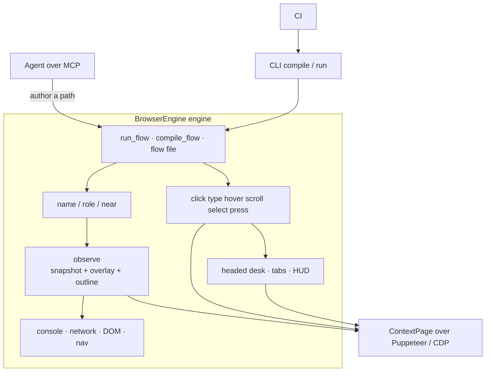
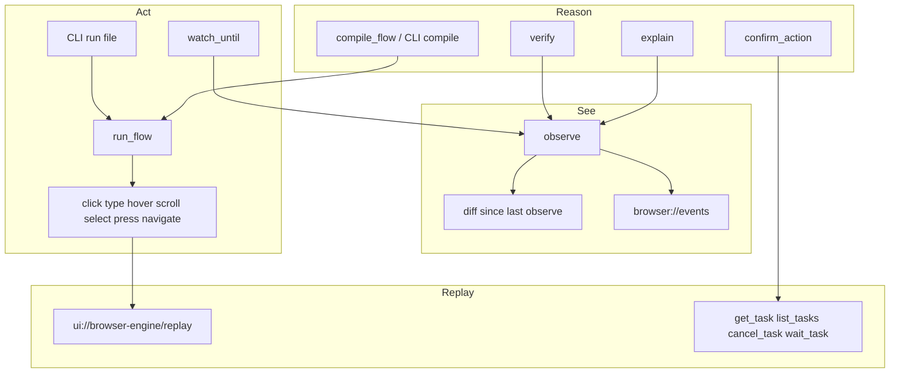

# Architecture

CLI and MCP are two clients of the same engine. Nothing in intent talks to a raw Puppeteer `Page`.



## Why this shape

Most browser stacks split "read the page" from "act on the page." One world is text, the other is pixels. The model re-reads every turn and guesses which box is which control.

BrowserEngine builds one object: names, roles, pixels, and events together. An agent can watch, act, wait, verify, and explain. After a path is named and saved, the same engine replays it with no model.

It borrows CDP patterns from `chrome-devtools-mcp` (stable uids, `ContextPage`, act-then-wait) and rebuilds them around named intent.

## Surface



`observe` is the unified primitive. Actions go through act-then-wait and seed the replay. A saved file is the same `run_flow` engine with no LLM. Destructive steps can pause on `confirm_action`.

## Milestones

| #   | Piece                                                                      | Milestone |
| --- | -------------------------------------------------------------------------- | --------- |
| 1   | **`observe`**: a11y snapshot, screenshot, overlay, outline                 | **M1**    |
| 2   | **Diff engine**: changes since last observe, fingerprint rebind            | **M2**    |
| 3   | **Events**: console, network, DOM, navigation, resize                      | **M3**    |
| 4   | **Action log + HUD**: click, type, hover, scroll, select, press, navigate  | **M4**    |
| 5   | **Intent**: `watch_until`, `compile_flow`, `run_flow`, `verify`, `explain` | **M6**    |
| 6   | **Saved flows**: versioned JSON, `compile` / `run` with no MCP             | **M6+**   |
| 7   | **MCP**: stdio and Streamable HTTP, `server/discover`, annotations         | **M5**    |
| 8   | **Desk**: `browser_status`, open/close/reap, tabs                          | **M5+**   |
| 9   | **MCP Apps replay**: `ui://browser-engine/replay`                          | **M7**    |

## What lives elsewhere

PremierQuality owns catalogs, testers, and release gates. BugTrace owns video. Customer capture widgets are a different product. Recorders that emit `#txt_visit_date` are not this.

## Layout

```text
src/
  actions/       ActionLog (replay seed), ActionRunner, StabilityWaiter
  apps/          MCP App replay HTML
  browser/       HUD, desk, tabs, launch, instance registry
  context/       ContextPage, a11y convert, recover, follow-window
  diff/          diff engine, fingerprint rebind
  events/        buffer, collector, normalize
  intent/        run_flow, compile_flow, flow file, verify, explain
  protocol/      MCP bridge, flow CLI, Tasks, MRTR, HTTP
  session/       BrowserSession composition root
  snapshot/      a11y snapshot, outline, overlay
  tasks/         TaskStore + TaskRunner
  tools/         defineTool, desk tools, observe, list_calls
  cli.ts         process entry: compile, run, MCP, --http
```

Shipped surface is this document plus [`usage.md`](usage.md) and [`ci.md`](ci.md). [`mvp.md`](mvp.md) is the original implementer brief. [`decisions.md`](decisions.md) wins when they conflict.
